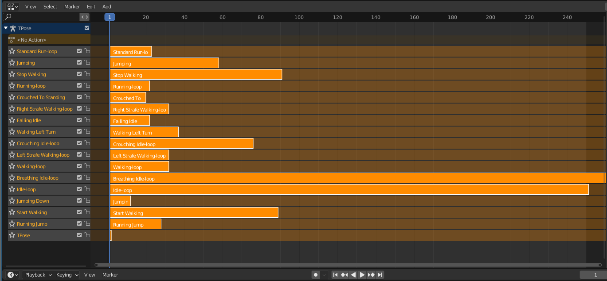

= Mixamo2Godot

Script to merge several Mixamo animations into one GLB file.

== Motivation

I try using the Blender plugin https://viniguerrero.itch.io/godot-game-tools[Godot GameTools] but the export
had some issues with root motion.

I did the export "by hand" by following the instructions in
this https://www.youtube.com/watch?v=3Hk9ljcS1Ro[video] and the export was perfect regarding root-motion.

In the comment of this video, someone provided a script for the whole process, but it did not work (the comment is two years old, probably some
issue with the new Blender version). I tried to correct it, but since I had no experience in Python nor in Blender API at the time, I could not
figure it out.

This seemed to be a good start for me to learn how to write script for Blender...

== The script

It performs all the steps described in this https://www.youtube.com/watch?v=3Hk9ljcS1Ro[video] :

* scales the animations (object and hips location)
* renames the bones
* adds one strip for each animation
* adds root motion (parents the hips, copies xz location keyframes...)

The script requires that :

. All the animations from Mixamo are in one directory
. One of the animation is the T pose, and it must be named `TPose.fbx`

You can then launch the script within Blender or from the command
line with `Blender --background --python /path/to/the/script -- /path/to/directory/of/animations`.

The name of the FBX files will be used to name the strips (you can add `-loop` to the name,
so that Godot will make it a loop). The base name of the directory containing the FBX file will be used for 
the blender and  the export file (with .blend and .glb added).
The export can be skipped by adding -ne to the previous command line (right after the `--`)

For instance, if in the folder `basic_movement` there are the following files :

* `Breathing Idle-loop.fbx`
* `Crouched To Standing.fbx`
* `Crouching Idle-loop.fbx`
* `Falling Idle.fbx`
* `dle-loop.fb`
* `Jumping Down.fbx`
* `Jumping.fb`
* `Left Strafe Walking-loop.fbx`
* `Right Strafe Walking-loop.fbx`
* `Running Jump.fbx`
* `Running-loop.fb`
* `Standard Run-loop.fbx`
* `Start Walking.fbx`
* `Stop Walking.fbx`
* `TPose.fb`
* `Walking Left Turn.fbx`
* `Walking-loop.fb`

After running the script, you will get an export named `basic_movement.glb` and a Blender file `basic_movement.blend` with the following nla :

